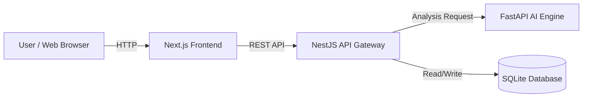

# Customer Review Sentiment Analyzer

A full-stack application that analyzes the sentiment of customer reviews using a microservices architecture.

## 🚀 Overview

This project demonstrates a robust, scalable microservices architecture integrating three major frameworks:
- **Frontend**: Next.js 14 (React)
- **API Gateway**: NestJS (Node.js)
- **AI Engine**: FastAPI (Python)
- **Database**: SQLite (via Prisma ORM)

The system accepts customer reviews via a web interface, routes them through an API Gateway to a Python-based Sentiment Analysis Engine, and stores the results for historical viewing.

## 🏗️ Architecture



## ✨ Features

- **Real-time Sentiment Analysis**: Classifies text as `POSITIVE`, `NEGATIVE`, or `NEUTRAL`.
- **Confidence Scoring**: Returns a confidence score (0-1) and breakdown of probabilities.
- **Modern UI**: Clean, responsive interface built with Tailwind CSS.
- **Microservices**: Decoupled services for frontend, backend logic, and AI computation.
- **Production Ready**: Includes Dockerfiles, connection pooling, and deployment scripts.

## 🛠️ Tech Stack

| Component | Technology | Description |
|-----------|------------|-------------|
| **Frontend** | Next.js 14, Tailwind CSS | Server-side rendering, responsive UI. |
| **Gateway** | NestJS | Request validation, routing, database interactions. |
| **AI Engine** | FastAPI, Python | Sentiment analysis logic (extensible). |
| **Database** | SQLite, Prisma | Lightweight, file-based relational database. |
| **Infrastructure** | Docker, Docker Compose | Containerization and orchestration. |

## 🏁 Getting Started

### Prerequisites
- Node.js 18+
- Python 3.9+ (optional, if running locally without Docker)
- Docker & Docker Compose (recommended)
- pnpm (`npm install -g pnpm`)

### Local Development (Monorepo)
1. **Install Dependencies**:
   ```bash
   pnpm install
   ```

2. **Initialize Database**:
   ```bash
   # Generate Prisma Client
   pnpm turbo run db:generate
   
   # Push Schema to SQLite
   pnpm turbo run db:push
   ```

3. **Start Development Server**:
   ```bash
   pnpm turbo run dev
   ```
   - Web Portal: [http://localhost:3001](http://localhost:3001)
   - API Gateway: [http://localhost:3000](http://localhost:3000)
   - AI Engine: [http://localhost:8000](http://localhost:8000)

### 🐳 Docker Run
You can run the entire stack with a single command:
```bash
docker compose up --build
```

## 📂 Directory Structure

```
├── apps/
│   ├── web-portal/    # Next.js Frontend
│   ├── api-gateway/   # NestJS Backend
│   └── ai-engine/     # FastAPI Python Service
├── packages/
│   ├── database/      # Prisma Schema & Client
│   ├── logger/        # Shared Logging Utility
│   └── ts-config/     # Shared TypeScript Configs
├── terraform/         # AWS Infrastructure (IaC)
└── docker-compose.yml # Local Development Orchestration
```

## ☁️ Deployment (AWS EC2)

This repository includes a production-ready `deploy.sh` script for AWS EC2 (Amazon Linux 2023).

1. **Provision Infrastructure**:
   Use the `terraform/` templates to create your EC2 instance and Security Groups.

2. **Deploy**:
   SSH into your server and run the deployment script. It handles:
   - Creating a swap file (for low-memory instances like t3.micro).
   - Building Docker images with cache optimizations.
   - Performing database migrations (if needed).
   - Starting services via `docker-compose.prod.yml`.

## 📜 License

MIT
